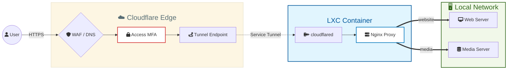

# 🌐 Homelab Ingress Gateway for Services

A secure reverse-proxy for accessing locally hosted services and apps over Internet.


# ⚙️ Architecture & Design
This solution is hosted within a dedicated Proxmox LXC container (Debian). It consists of a native installation of the Cloudflared tunnel and an Nginx reverse proxy.

The gateway is designed according to the Separation of Concerns (SoC) principle, isolating stable infrastructure (the tunnel) from dynamic application-level routing.




## Core Components

- **Cloudflared**: Bypasses CGNAT by establishing a secure outbound-only tunnel (no inbound ports exposed). This acts as a secondary tunnel in the infrastructure (first tunnel is for control plane) to maintain a clear separation between management and service traffic.
- **Nginx**: Serves as the primary reverse proxy. Each service is assigned an individual configuration file under /etc/nginx/conf.d/. Configurations stay consistent with the use of a universal Jinja2 template.
- **Ansible**: Automates provisioning and routing updates, ensuring the gateway remains in a "known-good" state and eliminating manual configuration.

## Project Structure
```
.
├── deploy.yaml          # Root Playbook (Orchestrator)
├── tasks/               # Modularized Logic
│   ├── cloudflared.yaml # Stable Infrastructure (Tunnel setup)
│   └── nginx.yaml       # Dynamic Routing (Proxy setup)
├── templates/
│   └── proxy.conf.j2    # Universal Nginx Blueprint
└── vars/
    └── services.yaml    # Single Source of Truth (Service Catalog)
```

## Design Decisions

- **Decoupled Service Catalog**: A central services.yaml file allows for the management of services (IP, domain, port, and WebSockets) without modifying global configuration files or core logic.
- **Modular Task Execution**: By splitting the logic into separate tasks for Cloudflared and Nginx, the system remains stable. Ansible Tags enable high-speed updates to the Nginx layer while skipping unchanged infrastructure.
- **Jinja2 Templating**: Utilizing a universal template reduces the error margin associated with manual Nginx configurations. It ensures every service automatically inherits security best practices, including CSP (Content Security Policy) and HSTS (HTTP Strict Transport Security).
- **Atomic Configuration Validation**: The deployment includes an automated syntax check (nginx -t) that runs before any service reloads. If a configuration error is detected, the playbook terminates immediately, preventing the live gateway from crashing.
- **Self-Healing Infrastructure**: Native systemd overrides are applied to both Nginx and Cloudflared. If either service fails, the OS is configured to automatically attempt a restart every 5 seconds, ensuring high availability without manual intervention.


## Security

- All services are exposed exclusively via Cloudflare Tunnel (no inbound ports).
- Access is enforced at the edge using Cloudflare Zero Trust (MFA required).
- WAF, rate limiting, and geo-restrictions are applied at the Cloudflare layer.

## Roadmap

- Implement a strategy to clean up old Nginx config files for services that are not in production anymore.

# ⚡ Quick Start

To execute the full deployment from a clean state:
`ansible-playbook deploy.yaml`

### Granular Updates (Using Tags)
To optimize deployment time, use tags to target specific layers of the stack:

Update Nginx installation only: `ansible-playbook deploy.yaml --tags nginx_install`

Update Nginx config & proxy only: `ansible-playbook deploy.yaml --tags nginx_proxy`

Provision Cloudflare only: `ansible-playbook deploy.yaml --tags infra`