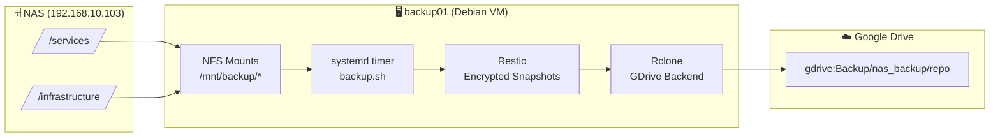

# ☁️ NAS to Google Drive Backup

An automated, encrypted backup pipeline that stores NAS data in snapshots into Google Drive using Restic with an Rclone backend, provisioned via Ansible and scheduled with systemd timer.

# ⚙️ Architecture & Design

Runs on a dedicated Debian VM (`backup01`) inside the Proxmox cluster. The VM mounts NAS shares over NFS in read-only mode. Restic then snapshots the data and pushes it to Google Drive via Rclone.



## Core Components

- **Restic**: Performs encrypted, deduplicated, incremental snapshots. Each run creates a new snapshot and enforces a configurable retention policy. 
- **Rclone**: Acts as the Google Drive backend for Restic. Configured manually via OAuth to avoid embedding credentials in automation.
- **Systemd Timer**: Triggers the backup script on a nightly schedule at 02:00 with up to 10 minutes of randomized delay to reduce load spikes.
- **Ansible**: Provisions the full stack in a repeatable, idempotent way. Secrets are managed via Ansible Vault.

## Project Structure

```
.
├── deploy.yaml        # Phase 1: System prep, installs, config deploy (timer not enabled)
├── activation.yaml    # Phase 2: Validates state, initializes repo, enables timer
└── templates/
    ├── backup.sh.j2           # Backup script (Restic run + retention)
    ├── backup.service.j2      # Systemd oneshot service unit
    └── backup.timer.j2        # Systemd timer unit
```

## Design Decisions

- **Two-Phase Deployment**: `deploy.yaml` installs and configures everything but deliberately does not enable the timer. `activation.yaml` is a separate, explicit step that validates all prerequisites (rclone config, repo reachability) before going live. This prevents a misconfigured system from silently failing on its first scheduled run.
- **Manual OAuth for Rclone**: The Google Drive OAuth flow requires browser interaction and produces a credential that is personal and long-lived. Rather than automating around this (service account, credential injection), it is treated as a one-time human step. The resulting `rclone.conf` is then copied to root and locked down with `600` permissions manually.
- **Read-Only NAS Access**: NAS shares are mounted read-only, and `root_squash` maps the client’s root user to an unprivileged account on the NAS. This prevents both write access and privilege escalation from the backup host.
- **Restic over Raw Sync**: Restic provides encrypted-at-rest snapshots, deduplication across runs, and point-in-time restore capability. This is preferred over tools like `rsync` which would require separate encryption and provide no snapshot history.
- **Root-Scoped Execution**: The backup process runs as root for consistent access to system paths and mounted storage. All sensitive files (rclone.conf, restic/password) are owned by root with 600 permissions.


## Security

- NFS shares are mounted read-only; the backup host cannot write to the NAS.
- Encryption is handled client-side by Restic before data leaves the VM.
- Restic repository is encrypted at rest with a password stored in `/etc/restic/password` (root-only, `0600`).
- Rclone config is stored at `/root/.config/rclone/rclone.conf` (root-only, `0600`).
- The restic password is deployed from Ansible Vault — it is never stored in plaintext in the repository.


## Roadmap

- Implement a logging and alerting solution (currently pending an infra-wide logging decision).
- Evaluate Google Cloud service account as an alternative to personal OAuth — better API limits and no personal token, at the cost of setup complexity and a required Google Cloud project.
- Automate password export for Ansible Vault bootstrapping.

# ⚡ Quick Start

### Phase 1 — Prepare the system

Installs packages, mounts NFS shares, deploys configs and systemd units. **Does not enable the timer.**

```bash
ansible-playbook deploy.yaml
```

### Manual Step — Configure Rclone (OAuth)

Run this on `backup01` a non-root user. If working in a VM, open an SSH tunnel first on your client device:

```bash
ssh -L 53682:127.0.0.1:53682 user@VM_IP
```

Then run the interactive config:

```bash
rclone config
# New remote -> name: gdrive -> type: Google Drive
# Paste Client ID and Secret -> Scope: 1 (full access)
# Follow the auth URL in your browser via the tunnel above
```
(Following the [original documentation](https://rclone.org/drive/#making-your-own-client-id) is suggested)

Once complete, copy the config to root:

```bash
sudo mkdir -p /root/.config/rclone
sudo cp ~/.config/rclone/rclone.conf /root/.config/rclone/rclone.conf
sudo chown root:root /root/.config/rclone/rclone.conf
sudo chmod 600 /root/.config/rclone/rclone.conf
```

### Phase 2 — Activate

Verifies the rclone config exists, checks (or initializes) the Restic repository, then enables and starts the timer.

```bash
ansible-playbook activation.yaml
```

### Validate manually

```bash
# Confirm rclone can see Google Drive
rclone listremotes
rclone ls gdrive:

# Confirm Restic can reach the repo
restic -r rclone:gdrive:Backup/nas_backup/repo snapshots

# Run a one-off backup
restic -r rclone:gdrive:Backup/nas_backup/repo backup /mnt/backup
```
