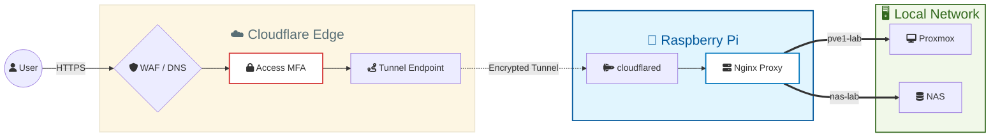

# 🛡️ Zero Trust Reverse Proxy Deployment
This is a reverse proxy solution to access my homelab remotely & securely over the internet. 

# ⚙️ Architecture & Design

## Core Components
- **Nginx:** Used for reverse proxy. It directs requests to the relevant destinations.
- **Cloudflare Tunnel:** Since my homelab is behind CGNAT (no static IP), I used Cloudflare tunnel to open my Gateway (Raspberry Pi) to the Internet with a public endpoint.
- **Cloudflare Zero-Trust:** Used Zero-Trust stack to create in-depth security while accessing resources, enforcing MFA.

## Cloudflare Config
Since these live outside of Git, they are documented here for reproducibility:
1. Used existing Cloudflared tunnel as management proxy
2. Conigured public hostnames (published application routes) on Cloudflare to route traffic to Nginx on port 8080.
3. Created Access Control policy, forcing using MFA on all existing subdomains

## Design Decisions
- **Flattened Subdomains:** Used service-lab.domain instead of service.lab.domain to remain compatible with Cloudflare's free-tier Universal SSL (which only supports 1 level of subdomains).
- **Nginx "Blackhole":** A default_server block is implemented to drop any unmapped traffic with a 404, preventing internal service leakage.
- **WebSocket Passthrough:** Custom headers are applied to support VNC and shell consoles in Proxmox.
- **Networking:** Used `network_mode: host` in Compose to allow Nginx direct access to gateway device's network interface

# ⚖️ The Verdict
Having direct access to lowest level of my homelab is useful while working remotely. However, for security wise, it might be best to disable all subdomains that are not used often.

## Roadmap
To further harden this deployment, the following features are planned:
- **Geo-Blocking (WAF):** Restrict access specifically to local IP ranges to reduce the attack surface.
- **HSTS & Security Headers:** Implementation of Strict-Transport-Security and X-Frame-Options within Nginx to mitigate man-in-the-middle and clickjacking risks.
- **Cloudflare WARP**: Integration of Cloudflare WARP to ensure only managed devices can access the gateway.

# ⚡ Quick Start
1. Update `nginx.conf` file according to your endpoints
2. Deploy to your desired endpoint with:
    `ansible-playbook deploy.yaml`
